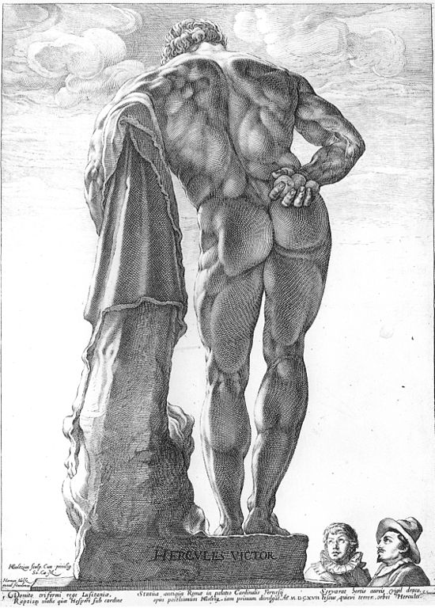
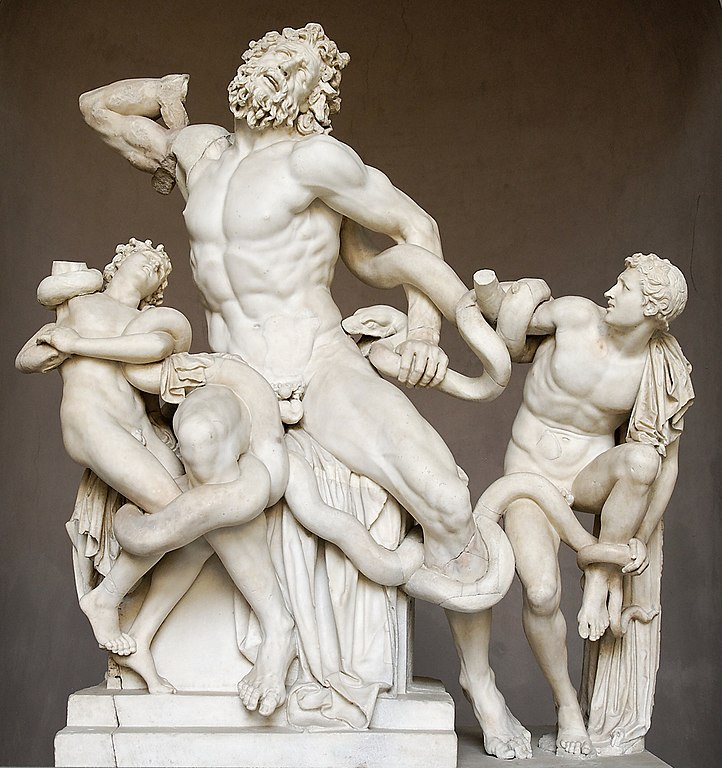
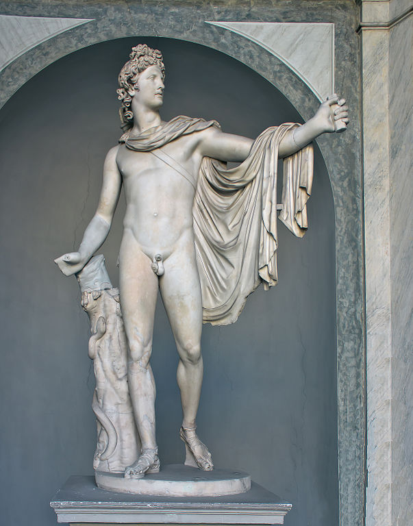
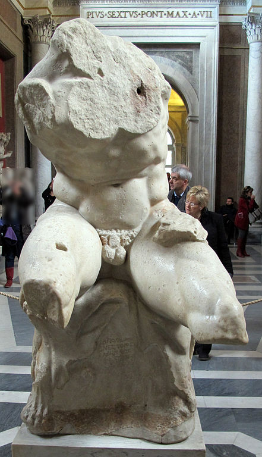

<!-- 以下に表を貼り付け -->

    <input type="radio" id="src-only" name="display" value="src-only" onchange="srcOnly()">
    <label for="src-only">原文のみ</label>
    <input type="radio" id="src-tgt" name="display" value="src-tgt" onchange="srcAndTgt()" checked>
    <label for="src-tgt">対訳</label>
    <input type="radio" id="tgt-only" name="display" value="tgt-only" onchange="tgtOnly()">
    <label for="tgt-only">訳文のみ</label>
    <table class="translation">
    <tr><td class="source"><h3 class="center"><b>Brief eines reisenden Dänen.</b></h3></td><td class="target"><h3 class="center">旅するデンマーク人の手紙</h3></td></tr><tr><td class="source">
(Der Antikensaal zu Mannheim.) 
</td><td class="target">
(マンハイムの古代の広間。)
</td></tr><tr><td class="source">
<i>Mannheim</i>.
</td><td class="target">
マンハイムにて。
</td></tr><tr><td class="source">
Der heutige Tag war mein seligster, so lang ich Deutschland durchreise. – Du weist es, mein Lieber, ich habe     die herrliche Schöpfung im glücklichen Süden genossen, den lachenden Himmel und die lachende Erde, wo der mildere     Sonnenstral zu fröhlicher Weißheit einladet, die freudegebende Traube kocht, und die göttlichen Früchte des Genies     und der Begeisterung zeitigt. Ich habe vielleicht das höchste der Pracht und des Reichthums gesehen. Der Triumph     einer Menschenhand über die hartnäckige Gegenwehr der Natur überraschte mich öfters – aber das nahe wohnende Elend     steckte bald meine wollüstige Verwunderung an. Eine hohläugige Hungerfigur, die mich in den blumigten Promenaden     eines fürstlichen Lustgartens anbettelt – eine sturzdrohende Schindelhütte, die einem pralerischen Pallast gegenüber     steht – wie schnell schlägt sie meinen auffliegenden Stolz zu Boden! Meine Einbildung vollendet das Gemählde. Ich     sehe jezt die Flüche von Tausenden gleich einer gefräßigen Würmerwelt in dieser großsprechenden Verwesung wimmeln –     Das große und reizende wird mir abscheulich. – Ich entdecke nichts mehr als einen siechen hinschwindenden     Menschenkörper, dessen Augen und Wangen von fiebrischer Röthe brennen, und blühendes Leben heucheln, während daß     Brand und Fäulung in den röchelnden Lungen wüthen. 
</td><td class="target">
今日という日は、ドイツを巡って旅してきたなかで最も幸福な日でした。――親愛なる君はご存知でしょうが、私は幸せな南方ですばらしい創造物を楽しんできました。天も地も晴れやかで、ドイツより穏やかな日差しが快活な英知へと誘い、喜びを与える葡萄が沸き立ち、天才と熱狂の神的な果実が熟するのです。ひょっとするとあそこで目にしたものこそ、豪華と富の極致だったのかもしれません。自然の強情な抵抗に対する人の手の勝利が、しばしば私を驚かせました――ですがその近くに巣食っている悲惨が、すぐに私の喜ばしい驚嘆にも感染してしまいました。豪勢な快楽の庭園の、花咲き乱れる遊歩道で私に施しをせがんだ、虚ろな目の飢えた人影――自慢げな殿堂の向かいに立つ、今にも崩れそうなこけら板の小屋――そうしたものが何とすばやく、飛び立とうとしていた私のうぬぼれを地に堕としてしまったことでしょう！　私の想像が、この絵画を完成させました。今や私は、貪欲なうじ虫の世界にも似た、何千人もの人々の呪詛が、この口だけは威勢のいい腐敗の中にうようよしているのを目にするのです――偉大で魅力的なものが、私には忌まわしいものになってしまいます。――目にとまるものといえば衰え滅びゆく人の肉体ばかりで、その熱にうかされたような赤さで燃える目と頬は、まるで人生の盛りのような装いですが、ぜいぜい言う肺の中では壊疽と腐敗が荒れ狂っているのです。
</td></tr><tr><td class="source">
Diß, mein Bester, sind so oft meine Empfindungen bei den Merkwürdigkeiten, die man in jedem Land einem Reisenden zu     bewundern gibt. Ich habe nun einmal das Unglück, mir jede in die Augen fallende Anstalt in Beziehung auf die     Glückseligkeit des Ganzen zu denken, und wie viele <i>Größen</i> werden in diesem Spiegel so <i>klein</i> – wie     viele Schimmer erlöschen! 
</td><td class="target">
これが、親愛なる友よ、しばしば私の感じるところなのです、あらゆる土地で旅人を驚嘆させようと供される、あらゆる奇妙なものを見るたびに。ともかく私は今や不幸にも、目に入るあらゆる施設を、全体の幸福との関連で考えるようになっています。そしてその全体の幸福という鏡の中では、いかに多くの<ruby>偉大なもの<rp>(</rp><rt>・・・・・</rt><rp>)</rp></ruby>が、実に<ruby>小さく<rp>(</rp><rt>・・・</rt><rp>)</rp></ruby>なってしまうことでしょう――いかに多くの輝きが、消え去ってしまうことでしょう！
</td></tr><tr><td class="source">
Heute endlich, habe ich eine unaussprechlich angenehme Ueberraschung gehabt. Mein ganzes Herz ist davon erweitert.     Ich fühle mich edler und besser. 
</td><td class="target">
今日ついに私は、言葉にできないほど気持ちの良い驚きを味わいました。私の心全体が、それによって広げられました。自分が前より高貴に、より良くなった気がします。
</td></tr><tr><td class="source">
Ich komme aus dem Saal der Antiken zu Mannheim. Hier hat die warme Kunstliebe eines deutschen Souverains die edelsten     Denkmäler griechischer und römischer Bildhauerkunst in einem kurzen geschmackvollen Auszug versammelt. Jeder     Einheimische und Fremde hat die uneingeschränkteste Freiheit diesen Schaz des Alterthums zu genießen, denn der kluge     und patriotische Kurfürst ließ diese Abgüsse nicht deßwegen mit so großem Aufwand aus Italien kommen, um allenfalls     des kleinen Ruhmes theilhaftig zu werden, eine Seltenheit mehr zu besizen, oder, wie so viele andere Fürsten, den     durchziehenden Reisenden um ein Allmosen von Bewunderung anzusprechen. – Der <i>Kunst</i> selbst brachte <i>Er</i>     dieses Opfer, und die dankbare Kunst wird seinen Namen verewigen. 
</td><td class="target">
私はマンハイムの古代の広間から出てきたところなのです。そこではあるドイツの専制君主の温かい芸術愛によって、ギリシアとローマの彫刻芸術の最もすぐれた記念物の数々が、短く趣味のよい抜粋にまとめられています。現地の者も他国の者も、制限なく自由にこれら古代の宝を鑑賞することができます。というのも、知略にたけた愛国的な選帝侯がこれほど費用をかけてイタリアからこれらの型取りによるレプリカを取り寄せたのは、よそよりひとつ希少品を多く持っているという小さな名声を得るためではないし、あるいは他の多くの諸侯のように、領地を通り抜ける旅人に、賛嘆という施しをせがむためでもないからです――<ruby>芸術<rp>(</rp><rt>・・</rt><rp>)</rp></ruby>そのものに、<ruby>侯<rp>(</rp><rt>・</rt><rp>)</rp></ruby>はこの供物を捧げたのであり、芸術はそれに感謝して、侯の名を永遠のものとしてくれるでしょう。
</td></tr><tr><td class="source">
Schon die Aufstellung der Figuren erleichtert ihren Genuß um ein großes. Leßing selbst, der hier gegenwärtig war,     wollte behaupten, daß ein Aufenthalt in diesem Antikensaal dem studierenden Künstler mehrere Vortheile gewährte, als     eine Wallfahrt zu ihren Originalien nach Rom, welche großentheils zu finster, oder zu hoch, oder auch unter den     schlechteren zu versteckt stünden, als daß sie der Kenner, der sie umgehen, befühlen und aus mehreren Augenpunkten     beobachten will, gehörig benuzen könnte. 
</td><td class="target">
像の配置がすでに、像を大いに鑑賞しやすくしてくれています。かつてここに来たレッシングも、研究中の芸術家にとっては、この古代の広間にいるほうが、ローマにオリジナルを巡礼しに行くよりも利点が多い、と主張していました。ローマのオリジナルはたいてい暗すぎたり、あまりに高いところにあったり、出来の劣る作品に埋もれてしまっていたりして、玄人が作品のまわりを巡ったり、触ってみたり、さまざまな視点から観察したりしたいと思っても、適切に利用できないからだ、というのです。
</td></tr><tr><td class="source">
Empfangen von dem allmächtigen Wehen des griechischen Genius trittst du in diesen Tempel der Kunst. Schon deine erste     Ueberraschung hat etwas ehrwürdiges, heiliges. Eine unsichtbare Hand scheint die Hülle der Vergangenheit vor deinem     Aug wegzustreifen, zwei Jahrtausende versinken vor deinem Fußtritt, du stehst auf einmal mitten im schönen lachenden     Griechenland, wandelst unter Helden und Grazien, und betest an, wie sie, vor romantischen Göttern. 
</td><td class="target">
ギリシアの守護神の全能の息吹に迎えられて、君はこの芸術の神殿に足を踏み入れます。最初に感じる驚きにも、既に何か畏敬すべき、神聖なものがあります。見えざる手が過去のベールを君の目の前でさっと取り払い、君が歩んでいく前で二千年の時が沈んでいき、気づけばもう君は美しい、晴れやかなギリシアの地に立っていて、英雄や優美な女性たちの間を逍遥し、彼ら彼女らと共にローマの神々を拝むのです。
</td></tr><tr><td class="source">
Dein erster Blick fällt auf die koloßalische Figur des farnesischen Herkules – die ungeheuer = schöne Darstellung     männlicher Kraft. Welche Kühnheit, Größe, Vollkommenheit, Wahrheit, die auch die strengste Prüfung des Anatomikers     nicht fürchtet. Wer hat den starren widerstrebenden Stein in so weiche, so geschmeidige Fleischmaßen hingegossen? –     Die Figur <i>ruht</i> – der Bildhauer ergriff seinen Herkules im Momente schlafender (vielleicht erschöpfter) Kraft,     und dennoch berechnet in dieser Erschlappung das ungeübteste Auge die ganze furchtbare Summe von Wirkungen. Meine     Phantasie leiht dem Kolossen Bewegung. Ich sehe eine Figur, wie diese, auf den nemäischen Löwen fallen, und     Schrecken und Erstaunen reißen mich schwindelnd fort. 
</td><td class="target">
最初に目にとまるのは、ファルネーゼのヘラクレス<a href="#fn1" class="footnote-ref" id="fnref1" role="doc-noteref">1</a>の巨大な姿――男性的な力の、途方もなく、かつ美しい表現です。解剖学者の厳密きわまりない検査すらも恐れない、なんという大胆さ、偉大さ、完全さ、そして真実でしょう。いったい誰が、硬く抗う石を、これほど柔らかくしなやかな肉のかたまりの形に注ぎ、作り上げたのでしょう？――この像は<ruby>休んで<rp>(</rp><rt>・・・</rt><rp>)</rp></ruby>います――彫刻家は、力が眠っている(あるいはひょっとすると、力を使い果たした)状態のヘラクレスを捉えたわけですが、それにも関わらずこの弛緩の中には、全くの素人の目でも、さまざまな活動の恐ろしいほどの総体がひそんでいると見積もることでしょう。私の空想力が、この巨体に動きを与えるのです。このような像がネメアの獅子<a href="#fn2" class="footnote-ref" id="fnref2" role="doc-noteref">2</a>に襲いかかる光景が目に浮かび、恐怖と驚愕に心を引きさらわれて目まいがするほどです。
</td></tr><tr><td class="source">
Zunächst an dieser fesselt dich die unnachahmliche Gruppe des Laokoon. Ich werde dir über diß Meisterstück der     antiken Kunst wenig neues mehr sagen; du kennst sie bereits, und der Anblick selbst überwältigt alle     Beschreibungskraft. Dieser hohe Schmerz im Aug, in den Lippen, die emporgetriebene arbeitende Brust – ein     Augenblick, ein Zustand, wo die Natur selbst sich so gern vergißt, so gern ins gräßliche ausartet, bei aller     Wahrheit so angenehm, bei aller Treue so delikat behandelt, daß sich das verwöhnteste Auge mit Trunkenheit darauf     heften kann. Und wie schmelzend wird dann die ganze Idee durch die untergeordnete Figuren der hilflosen Kinder,     welche durch die schreckliche Schlange an den Vater gepreßt werden. Der Ausdruck der Leidenschaft, und die ganze     Gruppierung lassen dem forschenden Aug nichts mehr zu beobachten übrig – und nun vertilge in Gedanken diesen ganzen     Ausdruck des Leidens, denke dir eben diese Figuren außer dem gewaltsamen Zustande des Affekts, und noch immer werden     sie Muster der höchsten Wahrheit und Schönheit seyn. Der griechische Künstler hat nichts aufgeopfert – die     unbeschreibliche Harmonie der Gruppe kostet uns auch nicht das leiseste Misfallen über vernachläßigte Theile in den     beiden Knaben. So schuf das Alterthum. 
</td><td class="target">
この像のすぐそばでは、模倣しがたいラオコーンの群像<a href="#fn3" class="footnote-ref" id="fnref3" role="doc-noteref">3</a>が君を魅了します、この古代芸術の傑作については、私はもはやほとんど新しいことは言えません。君もすでにこの群像を見たことがあるでしょうし、その眺め自体がどんな描写力をも圧倒してしまいます。目と唇にあるこの高貴な苦痛、上へ突き出され、鼓動している胸――自然自体が自らをたやすく忘れ、凄惨なものに堕してしまいかねない瞬間そして状態が、これほど真実ながらも実に快く、これほど忠実ながらも実に繊細に扱われて、習慣ですっかり鈍くなりきった目すらも、うっとりと釘付けになりうるのです。そして、無力な子供たちが下に配され、恐ろしい蛇によって父親に押しつけられていることによって、全体の着想がいかに心地よいものになっていることでしょう。熱情の表現、そして全体の配列は、探究する目にはこれ以上観察すべきものを残していません――さて今度は頭のなかで、こうした苦悩の表現を全て消し去って、情動の暴力的な状態を取り去ってこの像のことを考えてみてください、そうしてみてもなお、この像は最高の真実と美との手本であり続けるでしょう。作者たるギリシアの芸術家は、何も犠牲にしませんでした――この群像の筆舌に尽くしがたい調和は、二人の子供のおろそかにされている部分について、ほんのわずかな不満をも感じさせることがありません。古典古代では、そのように創作したのです。
</td></tr><tr><td class="source">
Unter allen Figuren, die dieser Saal enthält, ist der vatikanische Apoll die vollkommenste – Zwei Blicke auf     denselben sind genug, dir mit entscheidender Gewißheit zu sagen, du stehest vor einem Unsterblichen. Die reizendste     Jünglingsfigur, die sich eben jezt in den <i>Mann</i> verliert, Leichtigkeit, Freiheit, Rundung, und die reinste     Harmonie aller Theile zu einem unnachahmlichen Ganzen, erklären ihn zu dem ersten der Sterblichen, Kopf und Hals     verrathen den Gott. Diese himmlische Mischung von Freundlichkeit und Strenge, von Liebenswürdigkeit und Ernst,     Majestät und Milde, kann keinen Sohn der Erde bezeichnen. Die hochgewölbte Brust ist nach dem übereinstimmenden     Gefühl aller Künstler die vollkommenste, die je ein Maisel geschaffen hat; Schenkel und Füße ein Muster der edelsten     Schönheit. Den geübtesten Zeichner wird es ermüden, die herrlichen Formen, die durch kontrastierende Schlangenlinien     ineinander schmelzen, <i>nur</i> für das Aug nachzuahmen; denn der griechische Meister hat eben so delikat für das     Gefühl gearbeitet; das Auge erkennt die <i>Schönheit</i>, das Gefühl die <i>Wahrheit</i>. Die leztere ist der     ersteren untergeordnet, und obgleich kein Muskel vergessen ist, so hat doch der Künstler die feinere Nüancen dem     Gesicht entzogen, und der Berührung vorbehalten. Die Statue schwebt – alle Muskeln wirken aufwärts, und scheinen sie     sichtbar empor zu tragen. Der Künstler ergriff den Augenblick, wo der zürnende Gott auf den Drachen Python einen     Pfeil abgeschossen hatte. Der rechte Arm fliegt eben vom Bogen zurück, der linke behält noch einige Härte und     Spannung. – Im Auge ist hoher Unwille und feste Zielung, in der hervortretenden Unterlippe Verachtung des     Ungeheuers, in dem schlank gestreckten Halse Triumph und göttliche Ehre. 
</td><td class="target">
広間にある像の中では、バチカンのアポロン<a href="#fn4" class="footnote-ref" id="fnref4" role="doc-noteref">4</a>が最も完全です――二目見ればもう、自分は不滅なるものの前にいるのだと、きっぱり確信をもって断言できるでしょう。今まさに<ruby>大人<rp>(</rp><rt>・・</rt><rp>)</rp></ruby>となって消えていきつつある、この上なく魅力的な青年の姿、軽やかさ、自由、丸み、模倣しがたい全体をなしている、あらゆる部分のきわめて純粋な調和が、この像を、いずれ滅ぶものの中で第一級のものと定め、頭や首からは神の片鱗をのぞかせています。この親しみやすさと厳しさ、愛らしさとまじめさ、威厳と温和との天上のごとき混合は、地上の子には決して描写できません。高々と張られた胸は、あらゆる芸術家の一致した感想に従えば、これまで<ruby>のみ<rp>(</rp><rt>・・</rt><rp>)</rp></ruby>が創り出した中で最も完全な胸です。太ももと足は高貴きわまる美しさの手本と言えます。素描の達人がさんざん骨折っても、対照をなす蛇行した線の数々によって溶けあっているこのすばらしい形を、目のため<ruby>だけ<rp>(</rp><rt>・・</rt><rp>)</rp></ruby>に模写するのが精一杯でしょう。だけ、というのは、作者たるギリシアの巨匠は、感情に対しても同じくらい細やかに気を遣って仕上げているからです。つまり、目は<ruby>美しさ<rp>(</rp><rt>・・・</rt><rp>)</rp></ruby>を認識し、感情は<ruby>真実<rp>(</rp><rt>・・</rt><rp>)</rp></ruby>を認識するのです。後者は前者に従属するものであり、いかなる筋肉も忘れられていないにもかかわらず、作者はより繊細なニュアンスを顔から取り去り、感動のために留保しています。この像は浮遊しています――あらゆる筋肉が上方へ活動して、像を目に見えて上へと動かしているように思えるのです。作者は、怒れる神が竜ピュトンに矢を放った瞬間をとらえています。右腕はちょうど弓の反動で勢いよく戻ってきているところで、左腕はまだいくらかこわばりと緊張をとどめています。――目には高貴な不興と揺るがぬ狙いをたたえ、突き出た下唇には怪物への軽蔑が、すらりと伸ばされた首には勝利と神の栄光があらわれているのです。
</td></tr><tr><td class="source">
Das ist Foebos, welchen die Götter im Hause Cronions  fürchten, dem sie sich alle von ihren Sizen erheben,      wenn er sich naht, und wenn er spannt den stralenden Bogen. 
</td><td class="target">
ゼウス一族の神々が恐れるはポイボス(＝アポロン)、  彼が近づき、輝く弓を引き絞れば  神みな御座より立ち上がる。
</td></tr><tr><td class="source">
Homers Hymnen.
</td><td class="target">
ホメロスの賛歌<a href="#fn5" class="footnote-ref" id="fnref5" role="doc-noteref">5</a>
</td></tr><tr><td class="source">
In Absicht des Stils kann dieser Apollo dem Torso und Laokoon nachgesezt werden, aber der gefühlvolle Kenner vergißt     diese Vernachläßigung im Genusse höherer Schönheit. 
</td><td class="target">
様式の点ではこのアポロンはトルソーやラオコーンより下に置かれうるでしょうが、感情豊かな玄人であれば、そうしたおろそかな点は、より高貴な美しさを味わっているうちに忘れてしまうでしょう。
</td></tr><tr><td class="source">
Eine der vorzüglichsten Statuen, ist ein sterbender Sohn der Niobe, den Apollo erschossen hat. Der Kopf gleicht ganz     in die Niobische Familie – edel und rührend ist der Ausdruck des Sterbens in seinem Gesichte; die Brust besonders     ist in großen und schönen Maßen emporgetrieben, der untere Leib sinkt mit sehr vieler Wahrheit unter den lezten     Krämpfen des Todes. Der Stil ist markigt, und hat mit dem äußerst delikaten Stil des Kastor und Pollux sehr viel     ähnliches. 
</td><td class="target">
最もすぐれた像のひとつは、アポロンに射られて死に向かいつつあるニオベ<a href="#fn6" class="footnote-ref" id="fnref6" role="doc-noteref">6</a>の息子です。頭部は完全にニオベの家柄に相応しい出来栄えとなっています――その表情における死の表現は気高く、感動的です。特に胸は大きく美しい寸法で上へ突き出されており、下半身は実に真に迫った様子で、死の間際の最期の痙攣により沈みこんでいます。気骨ある様式で、カストールとポルックスの像のきわめて繊細な様式と大いに似通った部分があります。
</td></tr><tr><td class="source">
Unter die besten Stücke in diesem Saal zähle ich noch den <i>Antinous</i>;     Schade, daß durch einen fehlerhaften Abguß die Figur nach den Hüften und Schenkeln zu ein wenig krumm geworden; den     <i>borghesischen Fechter</i>, eine Figur, woran ich vorzüglich die Wahrheit des Muskelspiels bewundre, die Zwillinge     <i>Kastor</i> und <i>Pollux</i>, <i>Kaunus</i> und <i>Biblis</i>, den <i>Faun</i>, den <i>Schleifer</i>, besonders     wegen dem forschenden Ausdruck des Gesichts, und der Formen seiner beiden Arme, den <i>Hermaphrodit</i>, die     <i>medizäische Venus</i>, den <i>sterbenden Fechter</i>, den Römer <i>Germanikus</i>, und noch einige andre, von     denen ich dir in meinem nächsten Brief mehr sagen werde. 
</td><td class="target">
私としては、さらに以下の作品群も、この広間内の最良の作品に数え入れます。まず<strong>アンティノウス</strong><a href="#fn7" class="footnote-ref" id="fnref7" role="doc-noteref">7</a>。不手際な複製により、腰と太ももにかけて些かゆがんでしまっているのが残念です。次に<strong>ボルゲーゼの剣闘士</strong><a href="#fn8" class="footnote-ref" id="fnref8" role="doc-noteref">8</a>は特に筋肉の動きの迫真ぶりに感心します。それに<strong>カストール</strong>と<strong>ポルックス</strong>の双子<a href="#fn9" class="footnote-ref" id="fnref9" role="doc-noteref">9</a>、<strong>カウノス</strong>と<strong>ビュブリス</strong>の双子<a href="#fn10" class="footnote-ref" id="fnref10" role="doc-noteref">10</a>、<strong>ファウヌス</strong><a href="#fn11" class="footnote-ref" id="fnref11" role="doc-noteref">11</a>、そして特に探究するような表情と両腕の形ゆえに<strong>研ぎ師</strong><a href="#fn12" class="footnote-ref" id="fnref12" role="doc-noteref">12</a>も、それに<strong>ヘルマフロディトス</strong><a href="#fn13" class="footnote-ref" id="fnref13" role="doc-noteref">13</a>、<strong>メディチのヴィーナス</strong><a href="#fn14" class="footnote-ref" id="fnref14" role="doc-noteref">14</a>、<strong>瀕死の剣闘士</strong><a href="#fn15" class="footnote-ref" id="fnref15" role="doc-noteref">15</a>、ローマ人<strong>ゲルマニクス</strong><a href="#fn16" class="footnote-ref" id="fnref16" role="doc-noteref">16</a>、その他にもまだいくつかありますが、それについては次の手紙でもっとお話しします。
</td></tr><tr><td class="source">
Merkwürdig waren mir auch die Büsten der großen Griechen und Römer, der Kopf eines sterbenden <i>Alexanders</i>, der     <i>Niobe</i>, einer <i>Tochter</i> der <i>Niobe</i>, der <i>Kleopatra</i>, des <i>Nero</i> und <i>Kaligula</i>, der     <i>Faustina</i> und einige mehr. Der Zufall hatte den blinden <i>Homeruskopf</i> und den Kopf des Herrn von     <i>Voltaire</i> nebeneinander gestellt. – Ich weiß keine beißendere Satire auf unser Zeitalter. Voltaire – ich     glaube, daß man das jezt in Deutschland laut sagen darf – Voltaire war ein wahrhaftig großer Geist, aber warum war     mir sein Kopf in <i>dieser</i> Gesellschaft so lächerlich? 
</td><td class="target">
ギリシア・ローマの偉人たちの胸像も私には注目に値するものでした。瀕死のアレクサンダーの頭部や、ニオベ、ニオベの娘、クレオパトラ、ネロとカリギュラ、ファウスティーナらの頭部、その他にもいくつかありました。偶然にも、盲目の<ruby>ホメロスの頭部<rp>(</rp><rt>・・・・・・・</rt><rp>)</rp></ruby>と、<ruby>ヴォルテール<rp>(</rp><rt>・・・・・・</rt><rp>)</rp></ruby>氏の頭部とが、隣同士に並べられていました。――我々の時代に対する、これ以上に痛烈な風刺を私は知りません。ヴォルテールは――今ではドイツでも声を大にして言ってよいと思いますが――ヴォルテールは、真に偉大な精神の持ち主でした。ですが、<ruby>こうした<rp>(</rp><rt>・・・・</rt><rp>)</rp></ruby>面々に囲まれると、どうして彼の頭は、これほど滑稽に見えるのでしょう？
</td></tr><tr><td class="source">
Ich werfe noch einen Blick auf diese Statuen. 
</td><td class="target">
これらの像について、もう一度だけ目を向けることにします。
</td></tr><tr><td class="source">
Warum zielen alle redende und zeichnende Künste des Alterthums so sehr nach <i>Veredlung</i>? 
</td><td class="target">
古代の文学や美術は、どうしてこれほどまでに、みな<ruby>高貴化<rp>(</rp><rt>・・・</rt><rp>)</rp></ruby>を目指すのでしょうか。
</td></tr><tr><td class="source">
Der Mensch brachte hier etwas zu Stande, das mehr ist, als er selbst war, das an etwas größeres erinnert, als seine     Gattung – beweißt das vielleicht, daß er weniger ist, als er seyn wird? – So könnte uns ja dieser allgemeine Hang     nach Verschönerung jede Spekulation über die Fortdauer der Seele ersparen. – Wenn der Mensch <i>nur</i> Mensch     bleiben <i>sollte</i> – bleiben <i>könnte</i>, wie hätte es jemals Götter, und Schöpfer dieser Götter gegeben? 
</td><td class="target">
ここでは人間は、自らがそうであったもの以上の何か、自分の種属よりも偉大なものを思い出させる何かを実現させたのです――ひょっとするとこのことは、今の人間が、将来に人間がなるであろうものよりも劣るものだということを証明しているのでしょうか？――そうであれば、こうした美化への普遍的な傾向は、魂の持続についての思弁をすべて省いてくれさえするでしょう。――人間が<ruby>ただ<rp>(</rp><rt>・・</rt><rp>)</rp></ruby>人間のままでいる<ruby>べき<rp>(</rp><rt>・・</rt><rp>)</rp></ruby>であるのなら――人間のままでいることが<ruby>できる<rp>(</rp><rt>・・・</rt><rp>)</rp></ruby>のなら、どうしてかつて神々や、神々の創造者たちが存在したはずがあるでしょう？
</td></tr><tr><td class="source">
Die Griechen philosophierten trostlos, glaubten noch trostloser, und handelten – gewiß nicht minder edel als wir. Man     denke ihren Kunstwerken nach, und das Problem wird sich lösen. Die Griechen mahlten ihre Götter nur als edlere     Menschen, und näherten ihre Menschen den Göttern. Es waren Kinder <i>einer</i> Familie. 
</td><td class="target">
ギリシア人は慰めなく哲学して、いっそう慰めなく信仰しましたが、その行動は――間違いなく高貴さの点では私たちに劣っていませんでした。それはなぜなのか、という問題は、彼らの芸術作品についてじっくり考えてみれば自ずから解けるでしょう。ギリシア人は自分たちの神々を単により高貴な人間として描き、自分たちの人間を神々に近づけました。神々と人間とは、<ruby>ひとつの<rp>(</rp><rt>・・・・</rt><rp>)</rp></ruby>家族の子供同士だったのです。
</td></tr><tr><td class="source">
Ich kann diesen Saal nicht verlassen, ohne mich noch einmal an dem Triumph zu ergözen, den die schöne Kunst     Griechenlands über das Schicksal einer ganzen Erdkugel feiert. Hier stehe ich vor dem berühmten Rumpfe, den man aus     den Trümmern des alten Roms einst hervorgrub. In dieser zerschmetterten Steinmasse ligt unergründliche Betrachtung –     Freund! Dieser Torso erzählt mir, daß vor zwei Jahrtausenden ein großer Mensch da gewesen, der so etwas schaffen     konnte – daß ein Volk da gewesen, das einem Künstler, der so etwas schuf, Ideale gab – daß dieses Volk an Wahrheit     und Schönheit glaubte, weil einer aus seiner Mitte Wahrheit und Schönheit fühlte – daß dieses Volk edel gewesen,     weil Tugend und Schönheit nur Schwestern der nemlichen Mutter sind. – Siehe Freund, so habe ich Griechenland in dem     Torso geahndet. 
</td><td class="target">
この広間を離れる前に私は、ギリシアの美術が地球全体の運命に対しておさめた大勝利を、改めて喜ばずにはいられません。今ここで私は、かつて古代ローマのがれきから掘り出された、あの有名な胴体<a href="#fn17" class="footnote-ref" id="fnref17" role="doc-noteref">17</a>の前に立っています――友よ！　このトルソーは私に物語ってくれます、二千年前、このようなものを創ることのできる、偉大な人間がいたということを――このようなものを創った芸術家に、理想を与えた民族がいたということを――その民族が、心の底から真実と美とを感じていたがために、真実と美とを信じていたことを――そしてその民族が高貴であったということを、というのも徳と美とは同じ母から生まれた姉妹なのですから。――見て下さい友よ、このように、私はそのトルソーのなかにギリシアを感じたのです。
</td></tr><tr><td class="source">
Unterdessen wanderte die Welt durch tausend Verwandlungen und Formen. Trone stiegen – stürzten ein. Festes Land trat     aus den Wassern – Länder wurden Meer. Barbaren schmolzen zu Menschen. Menschen verwilderten zu Barbaren. Der milde     Himmelstrich des Peloponnes entartete mit seinen Bewohnern – wo einst die Grazien hüpften, die Anakreon scherzten,     und Sokrates für seine Weißheit starb, waiden jezt Ottomannen – und doch, Freund, lebt jene goldene Zeit noch in     diesem Apoll, dieser Niobe, diesem Antinous, und dieser <i>Rumpf</i> ligt da – unerreicht – unvertilgbar – eine     unwidersprechliche ewige Urkunde des göttlichen Griechenlands, eine Ausfoderung dieses Volks an alle Völker der     Erde. 
</td><td class="target">
そうこうするうちに、世界は幾千もの変貌と形態とを経て流転していきました。玉座がいくつも勃興し――崩壊しました。水中から陸地が現れ――陸が海になりました。野蛮人が文明人へと軟化し、文明人が野生化して野蛮人になりました。温和なペロポネソス地方は、住民もろとも退廃していきました――かつて優美の女神たちが舞い跳び、アナクレオンが冗談を飛ばし、ソクラテスが賢さゆえに死んだ地で、今ではオスマン人が放牧をしています――ですが友よ、あの黄金時代は、まだこのアポロンの中に、このニオベの、このアンティノウスの中に生きているのです、そしてこの<ruby>胴<rp>(</rp><rt>・</rt><rp>)</rp></ruby>の中には――凌駕されざるまま――決して絶やされることなく――神なるギリシアの、反論の余地のない永遠の証書が、ギリシア民族による、地上のあらゆる民族への挑戦状があるのです。
</td></tr><tr><td class="source">
Etwas geschaffen zu haben, das nicht untergeht, fortzudauren, wenn alles sich aufreibt, rings herum – O Freund, ich     kann mich der Nachwelt durch keine Obelisken, keine eroberte Länder, keine entdeckte Welten aufdringen – ich kann     sie durch kein Meisterstück an mich mahnen – ich kann keinen Kopf zu diesem Torso erschaffen, aber vielleicht eine     schöne That ohne Zeugen thun! 
</td><td class="target">
滅びないものを創ったこと、まわりのあらゆるものが消耗していっても、持続しつづけること――ああ友よ、私はオベリスクや征服地、発見した地によって後世に自分を押しつけることはできません――傑作によって自分のことを思い起こさせることもできません――私にはこのトルソーに頭を作ってやることはできません、ですがひょっとしたら、証人のいない美しい行いをすることは、できるかもしれません！
</td></tr><tr><td class="source">
T = = = = ee.
</td><td class="target">
T = = = = ee.
</td></tr>
    </table>

<ol>
<li
id="fn1">
ファルネーゼのヘラクレス＝オリジナルは前4世紀末のギリシア南部シキュオンの彫刻家による作品と考えられるが現存せず、シラーが見たレプリカはローマ時代のグリュコン(詳細未詳)による複製をもとにしている。複製はカラカラ帝の浴場から発掘され、現在はナポリの国立考古学博物館にある。当初は脚がなかったため想像で付け足され、1787年になってようやく本来の脚に代えられた。画像は1592年頃の版画(出典:
<a
href="https://commons.wikimedia.org/wiki/File:Goltzius,_Hendrik_-_Hercules_Farnese_-_c._1592.jpg">Wikimedia
Commons</a>)。<a href="#fnref1"
class="footnote-back" role="doc-backlink">↩︎</a>

</li>
<li
id="fn2">
ネメアの獅子＝ギリシア神話に登場するライオン。ヘラクレスにより倒された。<a
href="#fnref2" class="footnote-back" role="doc-backlink">↩︎</a>
</li>
<li
id="fn3">
ラオコーン群像＝アゲサンドロス、ポリュドロス、アテノドロスの3人の作とされる有名な彫刻。現在はバチカン美術館にある。シラーの一世代前、美術史家ヴィンケルマンが『ギリシア芸術模倣論』(<em>Gedanken
über die Nachahmung der grieschischen Werke in der Malerei und
Bildhauerkunst</em>,
1755)で、この像の激しい苦痛のわりに抑制された表情を、ラオコーンの魂の偉大さを示すものとしたのに対し、劇作家・批評家レッシングが『ラオコーン』(<em>Laokoon</em>,
1766)で、この表情の抑制は絵画と文学の本質的相違によるものと反論するという、いわゆる「ラオコーン論争」が起こった。下の写真は<a
href="https://en.wikipedia.org/wiki/File:Laocoon_Pio-Clementino_Inv1059-1064-1067.jpg">Wikimedia
Commons</a>より。<a href="#fnref3" class="footnote-back"
role="doc-backlink">↩︎</a>
</li>
<li
id="fn4">
バチカンのアポロン＝現在バチカン美術館にある「ベルヴェデーレのアポロン」のこと。紀元前4世紀の彫刻家レオカレスの青銅像の模刻と推測されている。ヴィンケルマンも、『古代美術史』(<em>Geschichte
der Kunst des Alterthums</em>, 1764, <a
href="https://www.deutschestextarchiv.de/book/view/winckelmann_kunstgeschichte01_1764/?p=218">S.
168</a>)において、この像が竜ピュトンを倒している姿だと解釈している。下の写真は<a
href="https://commons.wikimedia.org/wiki/File:Belvedere_Apollo_Frontal.jpg">Wikimedia
Commons</a>より。<a href="#fnref4" class="footnote-back"
role="doc-backlink">↩︎</a>

</li>
<li
id="fn5">
ホメロスの賛歌＝作者未詳だがホメロス作とも考えられた賛歌集。文中の一節はアポロン賛歌の冒頭部で、クリスティアン・フォン・シュトルベルクの訳(1782)の不正確な引用。<a
href="#fnref5" class="footnote-back" role="doc-backlink">↩︎</a>
</li>
<li
id="fn6">
ニオベ＝ギリシア神話の女性。タンタロスの娘で、自分の子供たちのことを女神レトに自慢したため、怒ったレトはアポロンとアルテミスを派遣して子供らを殺させた。<a
href="#fnref6" class="footnote-back" role="doc-backlink">↩︎</a>
</li>
<li
id="fn7">
アンティノウス＝ローマのハドリアヌス帝に寵愛された男性(111頃-130頃)。数多くの像が作られた。<a
href="#fnref7" class="footnote-back" role="doc-backlink">↩︎</a>
</li>
<li
id="fn8">
ボルゲーゼの剣闘士＝エフェソスのアガシアスによるギリシア後期の彫刻。現在はルーブル美術館蔵。<a
href="#fnref8" class="footnote-back" role="doc-backlink">↩︎</a>
</li>
<li
id="fn9">
カストールとポルックス＝ギリシア神話の英雄。星座のふたご座の由来となった。<a
href="#fnref9" class="footnote-back" role="doc-backlink">↩︎</a>
</li>
<li
id="fn10">
カウノスとビュブリス＝ギリシア神話の双子の兄妹。妹ビュブリスの愛を避けて兄カウノスが逃げ出し、妹はそれを追う途上で命を落とした。マンハイムにあったのは1700年頃にフランスの彫刻家が作ったもの。シラーの『ドン・カルロス』のタリーア草稿の本編冒頭にも、ト書きにこの兄妹の像が登場する。<a
href="#fnref10" class="footnote-back" role="doc-backlink">↩︎</a>
</li>
<li
id="fn11">
ファウヌス＝古代ローマの森の神。のちギリシア神話の牧神パーンと同一視された。<a
href="#fnref11" class="footnote-back" role="doc-backlink">↩︎</a>
</li>
<li
id="fn12">
研ぎ師＝マルシュアースの刑罰を描いた前3世紀頃の群像の部分複製。<a
href="#fnref12" class="footnote-back" role="doc-backlink">↩︎</a>
</li>
<li id="fn13">
ヘルマフロディトス＝ギリシア神話の両性具有の神。<a
href="#fnref13" class="footnote-back" role="doc-backlink">↩︎</a>
</li>
<li
id="fn14">
メディチのヴィーナス＝現在はウフィツィ美術館にある。ギリシアのブロンズ作品の摸刻。<a
href="#fnref14" class="footnote-back" role="doc-backlink">↩︎</a>
</li>
<li id="fn15">
瀕死の剣闘士＝現在はローマのカピトリーノ美術館蔵。<a
href="#fnref15" class="footnote-back" role="doc-backlink">↩︎</a>
</li>
<li
id="fn16">
ローマ人ゲルマニクス＝ゲルマニクス・ユリウス・カエサル(前15-後19)。古代ローマ帝国の軍人。<a
href="#fnref16" class="footnote-back" role="doc-backlink">↩︎</a>
</li>
<li
id="fn17">
有名な胴体＝ヘラクレスのトルソー(ヴェルヴェデーレのトルソー)のこと(前50年ごろのローマの模刻)。バチカン美術館所蔵。ヴィンケルマンが『ギリシア芸術模倣論』で賞賛し、シラーもここでその論に従っている。ただし、そこから歴史的考察に移る話の展開の仕方はシラー独自のものである。下の写真は<a
href="https://commons.wikimedia.org/wiki/File:Torso_del_belvedere,_forse_aiace_telamonio_che_medita_suicidio,_I_sec._ac._di_apollonios,_forse_da_bronzo_greco_del_200-150_ac._ca_01.JPG">Wikimedia Commons</a>より、Sailko撮影、CC-BY-SA 3.0。<a
href="#fnref17" class="footnote-back" role="doc-backlink">↩︎</a>

</li>
</ol>

原文出典: [Wikisource](https://de.wikisource.org/wiki/Brief_eines_reisenden_D%C3%A4nen)  
初出: Thalia. 1. Band, 1. Heft. Leipzig (Göschen) 1785, S. 176-184.  
全集: Friedrich Schiller: Werke und Briefe in zwölf Bänden, 8. Band: Theoretische Schriften. Hrsg. von Rolf-Peter Janz unter Mitarbeit von Hans Richard Brittnacher, Gerd Kleiner u. Fabian Störmer. Frankfurt a. M. (Deutscher Klassiker Verlag) 1992, S. 201-207. ※訳注はこの全集(FA=Frankfurter Ausgabe)の注を主に参考にした。